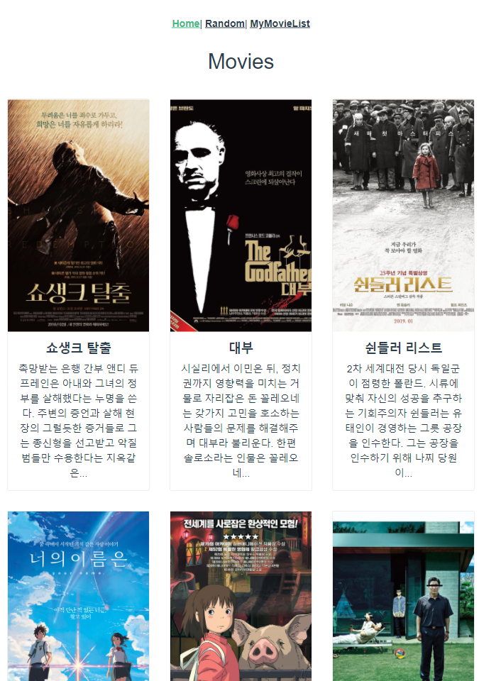
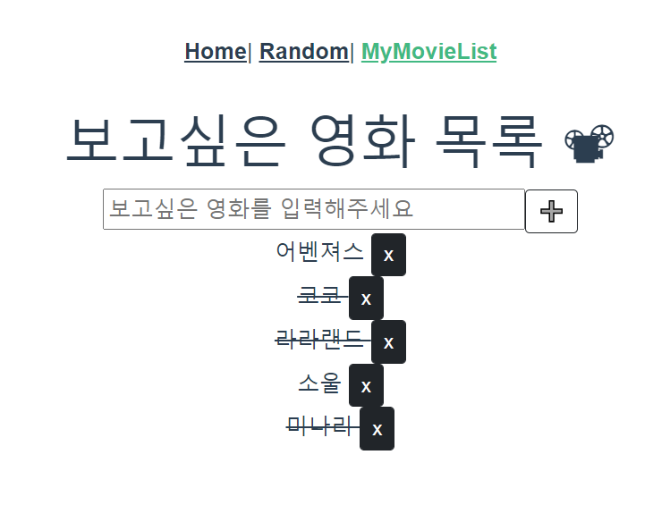
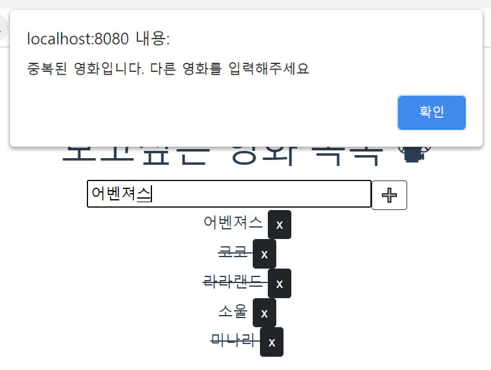
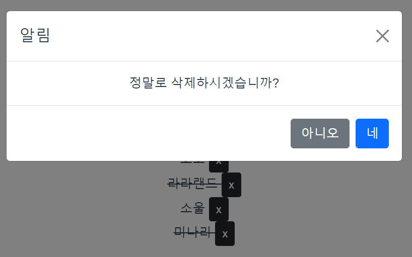

# Project 10_Vue를 활용한 SPA 구성

## 0. 개발 환경

- `package.json`파일 참고 ([바로가기 링크](package.json))

## 1. 프로젝트 소개

- **프로젝트 일시**: 2021.05.14 (금)
- **프로젝트 내용**
  - `vue-cli`, `vuex`, `vue-router` 를 활용하여 영화 정보를 제공하는 SPA 제작
- **역할 분담**: `vscode live share` 를 통한 역할 분담
  - 페어 류현선님: `Home.vue` / `MovieCard.vue` / `Random.vue`
  - 나: `MyMovieList.vue` / `MyListForm.vue` / `MyList.vue`

## 2. 문제 해결 과정

### 1. `App.vue`

> AJAX 통신으로 JSON 데이터 요청 및 저장하기
>
> [App.vue 바로가기](src/App.vue)

- 이번 프로젝트에서 가장 많은 시간을 소비한 부분이었다. 우리가 해결해야할 문제는 'AJAX를 통해 받아온 데이터를 어느 시점에 불러와야 하는가?' 였다. Home 페이지는 물론 Random 페이지에서도 영화 데이터가 필요했기 때문이다.
- 처음에는 히든 페이지나 버튼을 활용해서 버튼을 한 번 눌렀을 때, store에 영화 데이터가 저장되는 방법을 고려했다. 그런데 지난 자바스크립트 프로젝트 때 처럼 '버튼이 눌릴 때마다 store에 데이터가 추가돼서 엄청난 중복이 생기지 않을까' 하는 걱정이 되었다.
- 그러나 수업 시간에 진행했던 Youtube 프로젝트를 복습하며 내가 걱정하는 일이 발생하지 않는다는 점을 깨달았다. Vuex의 store는 DB에 저장이 되는 개념이 아니기 때문이었다.
- 그래서 라우터 링크 각각에 `@click="getMovies"` 속성을 주었다. 하지만 링크 태그라 그런지 메서드 실행이 되지 않았다. 결국 라우터 링크들을 div로 감싼 다음, div에 `@click="getMovies"`을 부여하는 방법으로 해결했다.

### 2. 영화 전체 데이터 출력

> 응답받은 영화 데이터를 카드 형식으로 출력한다.
>
> [Home.vue 바로가기](views/Home.vue)
>
> [MovieCard.vue 바로가기](src/components/MovieCard.vue)

1. `Home.vue`
   
   - 하위 컴포넌트가 영화 각각의 정보가 담긴 `MovieCard`고, Card Group 형식으로 출력하기를 원했기 때문에 `MovieCard`를 `div`로 감싼 후 `card-group` 클래스를 부여했다.
   
2. `MovieCard.vue`

   - 가로길이 `sm` 기준으로 한줄에 한 편씩 / 세 편씩으로 보여지는 반응형으로 구현했다.
   - 줄거리가 전부 출력되는 것이 아니라 앞의 일부만 나오게 만들고 싶었다. 구글링하여 `substr` 함수를 이용하면 문자열의 일부를 잘라서 가져올 수 있다는 사실을 발견했다.([관련 링크](https://webisfree.com/2014-07-23/[javascript]-%EB%AC%B8%EC%9E%90%EC%97%B4%EC%9D%98-%EC%9D%BC%EB%B6%80-%EA%B0%80%EC%A0%B8%EC%98%A4%EA%B8%B0-%EC%82%AD%EC%A0%9C%ED%95%98%EA%B8%B0)) `문자열.substr(시작위치, 나타낼 문자 길이)` 형식으로 사용하면 된다.
   - 한 단계 더 나아가서 줄거리 생략한 부분 다음에 `더보기` 버튼을 마우스 오버/클릭을 하면 전체 줄거리를 모달 형식으로 띄우는 방식을 구현할 수 있을 것이다. 최종 프로젝트 때 활용해야겠다!

3. 결과 사진

   

### 3. 랜덤 영화 제목 출력

> 버튼을 누르면 랜덤으로 영화 한 편의 정보를 출력한다.
>
> [Random.vue 바로가기](src/views/Random.vue)

- `lodash`의 `sampleSize`를 활용하여 영화 전체 데이터에서 랜덤으로 한 편 뽑는 `getRandomMovie` 메서드를 구현했다.

- 이 때, 랜덤으로 뽑은 `selectMovie` 를 DOM에 출력하는 과정에서 오류가 발생했다. 그 이유는 버튼을 누르지 않은 상태에서는 `selectMovie`가 `null`값으로 초기화된 상태이기 때문에 `title` 키에 접근할 수 없어서였다.

- 따라서 `v-if="selectMovie"`를 사용하여 `selectMovie`가 `true`일 때에만, 즉 버튼을 눌러서 데이터가 들어있는 상태에만 보여지게 함으로써 문제를 해결했다.

- 처음에는 명세대로 영화 제목만 보여지게 했는데, 현선이가 카드 형식으로 추가 구현해줬다. 열정맨! 🔥

- 결과 사진

  

### 4. 보고 싶은 영화 저장

> 보고 싶은 영화를 작성 후 리스트에 저장
>
> 감상한 영화 표시 및 삭제 기능, 중복된 영화 필터링 기능 구현
>
> [MyMovieList.vue 바로가기](src/views/MyMovieList.vue)
>
> [MyListForm.vue 바로가기](src/components/MyListForm.vue)
>
> [MyList.vue 바로가기](src/components/MyList.vue)
>
> [index.js 바로가기](src/store/index.js)

1. `MyMovieList.vue`: 가장 상위 컴포넌트로 2, 3번 컴포넌트를 담고 있다.

2. `MyListForm.vue`

   - 작성된 내용을 state에 추가하는 기본적인 기능 외에 중복을 필터링 하는 기능을 구현했다. 사소해 보였는데 은근히 까다로웠다.
   - 보고 싶은 영화(이하 `myMovie`)를 생성할 때 중복을 체크하기 위해 처음에는 `includes`라는 array helper method를 사용하여 '만약 보고 싶은 영화 목록(이하 `myMovies`)이 현재 추가하려는 영화를 포함한다면 alert 발생시킨다' 는 로직으로 구현했다.
   - 하지만 중복 체크가 되지 않았다. console에 찍어서 확인해보니 아예 if문으로 들어가지도 않았다. 😨 원인을 분석해보니`myMovies`는 object가 들어있는 배열이기 때문에 무작정 현재 영화의 title 값이 존재하는지 확인할 수가 없었다.
   - `javascript` 문법 내용을 복습하다가 `find`라는 메서드를 발견했다. 이번에는 '`myMovies`를 하나씩 돌면서 요소의 title 값이 현재 추가하려는 영화의 title 값과 같은지 찾는다'는 로직으로 구현했다.
   - 결과는 성공적이었는데, `find` 메서드의 이해가 부족하여 혼자 의문의 의문(?)을 가졌다. 그 의문은 `'자바스크립트에서는 빈 배열도 true라고 판단하니까 만약 중복이 되지 않는다면 find 메서드는 빈 배열을 return할 것이다. 그러면 중복이 되지 않아도 중복 여부에 걸리는게 아닌가? 왜 의도대로 작동하는걸까?'`였다(한마디로 이게 왜 되지?).
   - 하지만 이는 쓸데 없는 고민이었다. `find` 메서드는 찾는 값이 배열에 없으면 `undefined`를 반환하기 때문...! 덕분에 `find` 메서드에 대해 확실히 공부할 수 있었다.

3. `MyList.vue`

   - 이전에 했던 todo 프로젝트와 달리 `MyList`의 하위 컴포넌트가 존재하지 않기 때문에 `MyList` 단에서 `v-for`를 활용하여 하나씩 출력하게 구현했다.
   - 이 때, `p` 태그와 `button` 태그를 한 줄에 놓고자 `d-inline` 클래스를 부여하고 싶었는데, `p` 태그에 이미 `v-bind` 된 class가 있었기 때문에 어떻게 클래스를 부여할 수 있을지 고민이 되었다. 그런데 해결법은 의외로 단순! `:class`랑 `class` 둘 다 쓰면 된다.
   - 출력기능뿐만 아니라 감상한 영화를 클릭하면 취소선이 그어지게 했고, 삭제 버튼에 모달까지 달았다.
   - 그런데 모달이 또... 오류를 일으켰다. 삭제 알림 모달 창에서 '네' 버튼을 누르면 모달 창이 사라져야 하는데, 데이터만 삭제되고 모달 창이 사라지지 않는 것이었다. 이는 `data-bs-dismiss="modal"` 속성을 부여해서 해결했다.
   - 전에 했던 프로젝트에서는 굳이 이런 속성 없이도 모달 창이 잘 사라졌는데 왜일까? `url`로 `post` 요청을 보내는 `form`과 바로 삭제 함수를 실행하는 `button`이라는 차이 때문인걸까?
   - 그런데 README를 쓰며 모달의 오류를 발견했다.. 삭제 버튼을 누르면 계속 가장 첫번째 요소만 사라진다는 것... 주말에 다시 확인을 해봐야겠다 😢

4. 결과 사진

   - 보고 싶은 영화 추가 / 본 영화 체크

     

   - 중복 영화 추가 시 alert

     

   - 삭제 시 modal (문제 해결중)

     

## 3. 후기

💡 총평: 이번 프로젝트를 통해 Vue.js와 Vue router, Vuex에 대해 더 확실히 알 수 있었다. 특히 JSON 데이터를 요청, 저장하는 과정에서 Vuex의 state와 서버(django)의 DB 차이를 확실히 구분하게 되었다. 또한 최종 프로젝트에 앞서 페어인 현선이와 처음 함께 프로젝트를 진행한건데 서로 배려하면서 문제를 해결해나가서 뿌듯하다. 최종 프로젝트는 할 게 더욱 많아서 막막하기도 하지만, 함께 차근 차근 해결해나가면서 좋은 웹 서비스를 만들어야겠다.

🙂 잘한 점

- '중복 여부 필터링' 이라는 새로운 기능을 구현해본 점

**🙁 아쉬운 점**

- 모달 오류를 해결하지 못한 점 (여러모로 호락호락하지 않다)